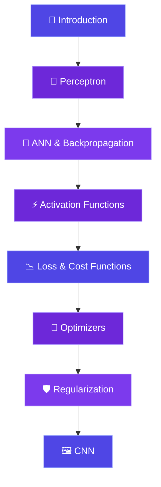

<div align="center">

# 🧠 Deep Learning

[](https://git.io/typing-svg)

<br/><br/>


<br/><br/>


</div>

---

<div align="center">

# 📚 Topics Covered

</div>

<br/>

<div align="center">

<table>

<tr>

<td align="center" width="220">

<br/>

<b>Foundations</b><br/>

<sub>Perceptron Intuition<br/>Why Deep Learning?<br/>ANN Intuition<br/>Backpropagation</sub>

</td>

<td align="center" width="220">

<br/>

<b>Activation Functions</b><br/>

<sub>Sigmoid &amp; Tanh<br/>ReLU &amp; Leaky ReLU<br/>Parametric ReLU &amp; ELU<br/>Softmax</sub>

</td>

<td align="center" width="220">

<br/>

<b>Loss &amp; Cost Functions</b><br/>

<sub>Regression Loss<br/>Classification Loss<br/>Cross Entropy<br/>When to Use What</sub>

</td>

</tr>

<tr>

<td align="center" width="220">

<br/>

<b>Optimizers</b><br/>

<sub>Gradient Descent<br/>SGD &amp; Momentum<br/>Adagrad &amp; RMSProp<br/>Adam Optimizer</sub>

</td>

<td align="center" width="220">

<br/>

<b>Regularization</b><br/>

<sub>Vanishing Gradient<br/>Exploding Gradient<br/>Weight Initialization<br/>Dropout Layers</sub>

</td>

<td align="center" width="220">

<br/>

<b>Convolutional Networks</b><br/>

<sub>CNN Architecture<br/>Convolution &amp; Pooling<br/>Padding &amp; Flattening<br/>CNN vs ANN</sub>

</td>

</tr>

</table>

</div>

---

# 📂 Repository Structure

```text
Deep-Learning/
│
├── 01_Introduction/
├── 02_Why_Deep_Learning/
├── 03_Perceptron/
├── 04_ANN/
├── 05_Backpropagation/
├── 06_Chain_Rule/
├── 07_Vanishing_Gradient/
│
├── Activation_Functions/
│   ├── 08_Sigmoid/
│   ├── 09_Tanh/
│   ├── 10_ReLU/
│   ├── 11_Leaky_ReLU_Parametric/
│   ├── 12_ELU/
│   └── 13_Softmax/
│
├── Loss_Functions/
│   ├── 14_Loss_vs_Cost/
│   ├── 15_Regression_Loss/
│   └── 16_Classification_Loss/
│
├── Optimizers/
│   ├── 17_Gradient_Descent/
│   ├── 18_SGD/
│   ├── 19_Mini_Batch_SGD/
│   ├── 20_SGD_Momentum/
│   ├── 21_Adagrad/
│   ├── 22_RMSProp/
│   └── 23_Adam/
│
├── Regularization/
│   ├── 24_Exploding_Gradient/
│   ├── 25_Weight_Initialisation/
│   └── 26_Dropout/
│
├── CNN/
│   ├── 27_CNN_Introduction/
│   ├── 28_Human_Brain_vs_CNN/
│   ├── 29_Images_in_Deep_Learning/
│   ├── 30_Convolution_Operation/
│   ├── 31_Padding/
│   ├── 32_CNN_vs_ANN/
│   ├── 33_Pooling_Layers/
│   └── 34_Flattening_FC_Layers/
│
└── README.md
```

---

# 🗺️ Learning Roadmap



---

# 🔬 Key Concepts at a Glance

<div align="center">

| Category | Topic | Key Takeaway |
|:---:|:---:|:---|
| 🧠 | **Perceptron** | The building block of every neural network |
| 🔗 | **ANN** | Layered neurons learning complex patterns |
| 🔄 | **Backpropagation** | Error flows backward to update weights |
| ⚡ | **Sigmoid** | Classic but suffers vanishing gradients |
| ⚡ | **ReLU** | Go-to activation for hidden layers |
| ⚡ | **Softmax** | Perfect for multi-class classification |
| 📉 | **Cross-Entropy Loss** | Standard for classification tasks |
| 🏃 | **Adam** | Best all-round optimizer |
| 🛡️ | **Dropout** | Prevents overfitting by random neuron drops |
| 🖼️ | **CNN** | Extracts spatial features from images |
| 🏊 | **Max Pooling** | Reduces spatial dimensions, retains key features |

</div>

---

# 📊 GitHub Stats

<div align="center">


&nbsp;


<br/><br/>


</div>

---

# 📈 Contribution Activity

<div align="center">


</div>

---

<div align="center">


</div>
